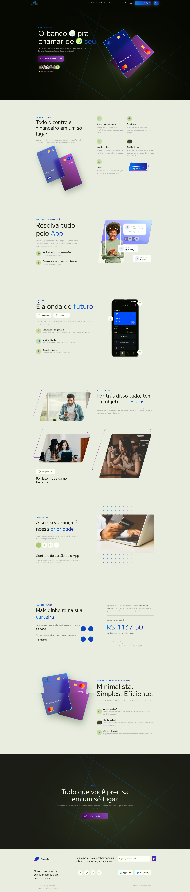

# PayBank - Digital Banking Experience


> O banco pra chamar de seu. / The bank to call your own.

## 📋 Overview

PayBank is a modern digital banking platform designed to provide users with a seamless financial experience. This project showcases a responsive, interactive front-end implementation of a digital banking interface with a focus on beautiful UI/UX and smooth animations.

## ✨ Features

- **Digital Account Management**: Virtual account dashboard with transaction history
- **Interactive Card Visualization**: 3D card animations and interactive display
- **Investment Calculator**: Real-time CDI investment calculator
- **Multi-language Support**: Seamlessly switch between Portuguese and English
- **Responsive Design**: Fully responsive layout that works on all devices
- **Modern UI Components**: Accordions, interactive icons, and animated elements

## 🛠️ Technologies
<div align="center">
    <div>
        
        
        
    </div>
</div>

The project is built using the following technologies:

### Frontend
- **HTML5** - Semantic structure and content
- **CSS3** - Advanced styling with flexbox, grid, and animations
- **JavaScript** - DOM manipulation and interactive elements

### Libraries
- **GSAP** - Advanced animations and transitions
- **ScrollTrigger** - Scroll-based animations
- **SVG-Inject** - SVG handling and manipulation

### Design
- **Google Fonts** - "M PLUS 1" and "Red Hat Display" fonts
- **Custom SVG Icons** - Extensive use of SVG assets for crisp, scalable graphics
- **CSS Animations** - Keyframe animations and transitions

## 🏗️ Project Structure

```
pay-bank/
├── css/
│   └── style.css
├── fonts/
│   └── [font assets]
├── js/
│   ├── gsap.min.js
│   ├── ScrollTrigger.min.js
│   ├── script.js
│   ├── svg-inject.min.js
│   └── translations.js
├── svg/
│   └── [svg assets]
└── index.html
```

## 🌟 Key Functionalities

### Investment Calculator
The platform includes a real-time CDI (Certificado de Depósito Interbancário) calculator that allows users to:
- Adjust investment amount with increment/decrement controls
- Modify investment time period
- See real-time calculation of returns

### Multi-language Support
Users can toggle between Portuguese and English languages throughout the interface.

### Responsive Card Designs
The digital cards feature:
- 3D animations
- Front and back visualization
- Security features showcase

### Interactive Navigation
- Smooth scrolling
- Header transformation on scroll
- Interactive accordion elements

## 🚀 Getting Started

1. Clone the repository:
```bash
git clone https://github.com/your-username/pay-bank.git
```

2. Open the project in your code editor

3. Launch the index.html file in a modern web browser

## 📱 Browser Compatibility

The application is optimized for modern browsers:
- Chrome (latest)
- Firefox (latest)
- Safari (latest)
- Edge (latest)

## 🖼️ Screenshots

 

## 👨‍💻 Development

The project uses vanilla JavaScript with GSAP for animations. Key development features include:

- Modular JavaScript organization
- CSS variables for consistent theming
- Responsive design with carefully crafted breakpoints
- SVG integration for crisp graphics
- Performance optimizations for smooth animations

## 🤝 Contributing

Contributions, issues, and feature requests are welcome! Feel free to check the [issues page](https://github.com/your-username/pay-bank/issues).

## 📝 License

This project is [MIT](LICENSE) licensed.

---

Developed with ❤️ by [Patrique P Porto](https://github.com/patriqueporto)
